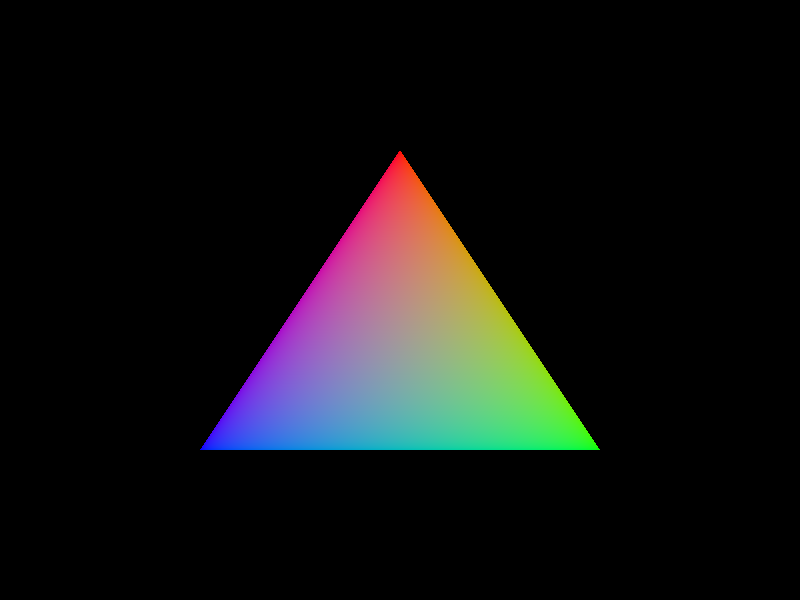

# vulkan-mojo
Generated Mojo bindings for the Vulkan graphics API

## Overview
- Generated from vk.xml
- More or less 1:1 mapping to original API
- Unsafe. Use validation layers to catch mistakes
- Linux only currently

## Usage

#### Structs don't currently carry origins of pointers
```mojo
var queue_priorities = InlineArray[Float32, 1](1.0)
var queue_create_info = vk.DeviceQueueCreateInfo(
    queue_family_index = queue_family_index,
    queue_count = len(queue_priorities),
    p_queue_priorities = queue_priorities.unsafe_ptr(),
)
...
_ = queue_priorities # necessary to make sure pointer in queue_create_info remains valid
```

#### Hpp-style convenience functions for the 2 call pattern
```mojo
var extension_properties_result = vkg.enumerate_instance_extension_properties(Ptr[UInt8]())
```
instead of 
```mojo
# and this leaves out proper error handling
var count: UInt32 = 0
var result = vki.enumerate_foo(count, UnsafePointer[vk.ExtensionProperties]())
var extension_properties = UnsafePointer[vk.ExtensionProperties].alloc(count * size_of[vk.ExtensionProperties]())
result = vki.enumerate_foo(count, extension_properties)
```

Check examples for more detail

## Included Example
Basic Triangle
